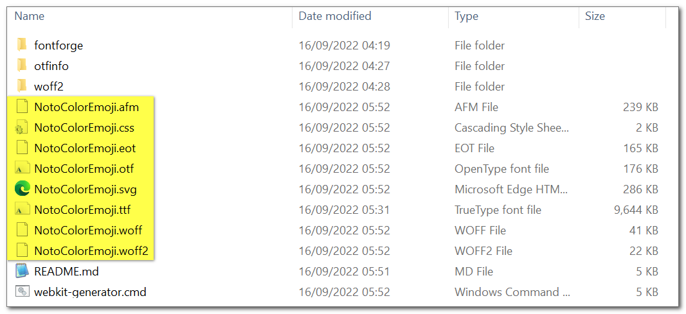

<h1>1st Font-WebKit-Generator</h1>

ready-to-use, zero effort kit for Windows users, to generate a complete font-webkit for the web.  
all dependencies included, zero-knowledge-needed.  

you get both css, populated with actual font-information (and web-best practices),  
as well as all the font-formats you'll need.

convert fonts from any source you have, no questions asked.  

fast, safe, secure. everything is done 100% locally.

<a href="https://paypal.me/%65%31%61%64%6B%61%72%61%6B%30/%35%55%53%44" title="show your support">♥</a>  

 

 

<h3>how to use:</h3>

0. download, unzip: https://github.com/eladkarako/1st_font_webkit_gen/archive/refs/heads/master.zip  
1. drag&amp;drop any type of font-file over `webkit-generator.cmd` .  
2. wait...  
3. done. copy font-files and css to your web-server .  

note:  
you can drag&amp;drop any amount of font-file you want,  
they will be converted one-by-one,  
each will get its-own CSS.

note:  
a convertion text-report is available,  
it is a `afm` file (filename will match your font-file).  

  

  

  

  

<h3>description of steps in script:</h3>

1. backup of original font-file .  
2. converting the font-file to `eot`, `svg`, `otf`, `ttf`, and `woff` with `FontForge` .  
3. converting `ttf` to `woff2` with `woff2_compress` .  
4. restoring original font-file .  
5. `OTFInfo` is used to query the `ttf` for `font-family` .  
6. `css` is generated based on (generic) best practices. it uses the filename of the font-file, and the `font-family` .  
7. done, collect the font-files and the css. and place on your server .  
8. optional: edit the css .  

<h3>best practices that included in the css:</h3>

0. instruction to load local installed font if possible (by `font-family`) .  
0.1. when an instruction to load a font is supported by the browser, it will not load up all the other types .  
0.2. loading order is `eot` (must, to support older browsers), `ttf`, `otf`, `woff2`, `woff`, and `svg` .  
1. do not delay displaying content, refresh rendered content when font loads up (with `font-display`) .  
2. explicitly specify `mimetype` of the fonts. it helps the browser. with `format( )` .  
3. make sure the rendering is done with UTF-8 support, implicitly using some emoji in a comment .  
4. note: helps the users by providing an example - how to specify the `font-family` for `html` (and `input` and `textarea`) .  
5. note: helps the users by including a fallback font. with `, sans-serif` .  
6. note: helps the users by including font data explicitly. with `font-weight` and `font-style` .  

<h3>checklist for users:</h3>

1. verify fonts valid. sometimes `otf` converting generates an invalid `otf` .  
2. if you don't need as much types, delete and edit the `css` .  
3. try to preserve the order. `ttf` are the most supported, `eot` needs to be on top for compatibility, `woff2` is smaller than `woff`, and some users disable `svg` support, so it is last .  

<h3>TODO for developers:</h3>

1. more information from the font .  
1.1. populate `unicode-range` in the css to help a more efficient loading .  
1.2. accurate `font-style` and `font-weight` will be helpful .  
2. native VC builds, dynamic. to remove dependency with cygwin dll files .  
3. reduce kit weight .  
4. alternative to `FontForge` that supports font convertion better, not breaking fonts, preserve/support tables .  
5. pre-validate/make sure font-file is not corrupted .  
6. build for other architectures .  
7. switch from `cmd` to `nodejs` for the script (easiest way to have support for all OS for the script) .  

<h3>development history</h3>

original repository was made back in October 2017,  
builds (and cygwin dependencies) in September 2022,  
along with post-build binary patching - icon, version-info, manifest for Windows 10/11,  
with https://github.com/eladkarako/manifest  

<h3>resource used:</h3>

1. Noto Emoji (example): https://github.com/googlefonts/noto-emoji/blob/main/fonts/NotoColorEmoji_WindowsCompatible.ttf .  
2. `FontForge`:  https://github.com/fontforge/fontforge/actions (mingw64 artifact) .  
3. `otfinfo` and `woff2` - fresh cygwin amd64 builds from source .  

all opensource, licences varies, everything I've wrote is 'The UnLicensed' .  

 

